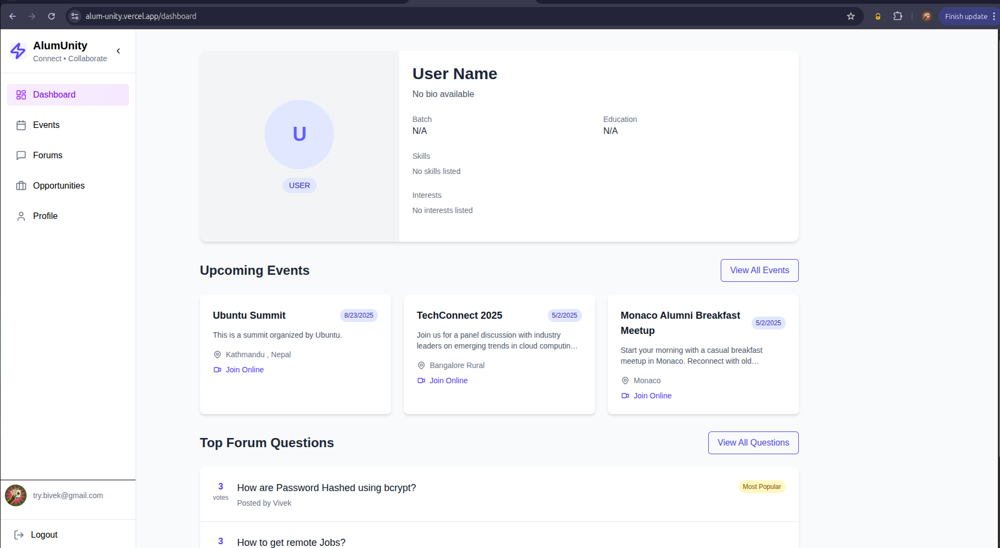

# AlumUnity

Bringing students and alumni together in one seamless, interactive platform.

Overview
AlumUnity helps colleges and universities build stronger networks by connecting current students with alumni. The platform makes it easy to host live events, run discussions, share opportunities, and keep profiles up to date — all in a polished, user-friendly interface.

Key product capabilities
- Single sign-on with Google and GitHub for secure, fast access.
- Live video meetings integrated directly into the platform — host talks, panels, and Q&A sessions without leaving the site.
- Events: alumni and student organizers can create events, share join links, and manage attendees.
- Forums: post questions, answer, and vote; surface the most helpful conversations for the community.
- Opportunities: alumni can post jobs and internships; students can browse and apply.
- Profile & Dashboard: users see their profile, upcoming events, and top forum activity at a glance.

How it works (simple)
1. Sign in with Google or GitHub.
2. Explore your dashboard to see your profile, upcoming events, and trending forum questions.
3. Join live sessions directly inside the platform (no third-party tools required).
4. Create or RSVP to events, participate in forum discussions, and apply to opportunities.
5. Update your profile so your community sees your latest experience and availability.

Why organizations love AlumUnity
- Engages alumni with minimal friction.
- Provides a modern, all-in-one place for mentorship, hiring, and community events.
- Reduces tool-switching by embedding live interaction directly in the product.

User-focused examples
- A local alumni chapter hosts a panel — students join the live stream, ask questions, and network afterwards.
- An alumnus posts an internship opening — students apply and follow up through the platform.
- A student posts a technical question — top answers rise through voting and mentorship opportunities follow.

Getting started (for end users)
- Create an account using Google or GitHub.
- Complete your profile so alumni can find and connect with you.
- Browse Events to discover upcoming sessions or create one if you’re hosting.
- Use Forums to ask questions or help others.
- Check Opportunities regularly and apply with your profile.

Support & feedback
For questions, bug reports, or feedback, reach out to the project maintainers or your institution’s digital services contact. If you'd like to contribute or customize AlumUnity for your organization, contact the team to discuss partnership options.

Brand & license
AlumUnity is designed as a polished, production-ready experience for academic communities. Check the repository for licensing and contribution details.

Thank you for building stronger student–alumni connections with AlumUnity.